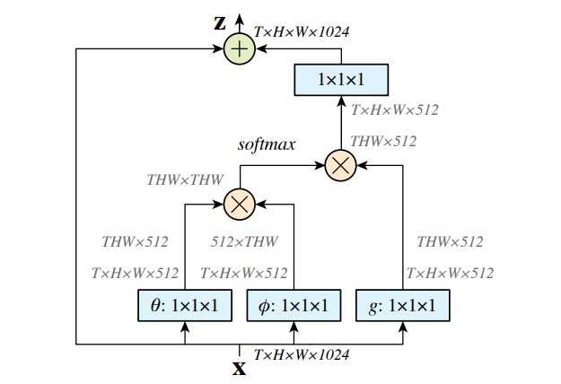
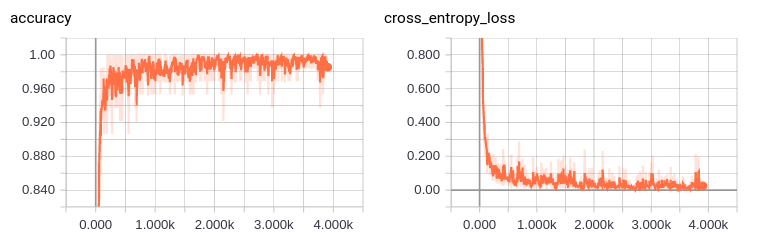
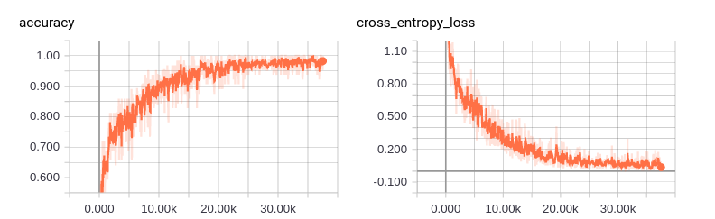

# Non-Local-Nets
  - This is an implement of Non-local neural networks for tensorflow version. [Here](https://arxiv.org/pdf/1711.07971.pdf), you can see the paper provided by Xiaolong Wang et.al.
  
  - Non-Local-Block shows below:
  
  

  
# Requirements
  - python 2.7
  - tensorflow > 1.0.0
  - numpy
  - tqdm
  - cPickle(python2.7), pickle(python3.*)

# Usages
## Download Repo
    $ git clone https://github.com/nnuyi/Non-Local-Nets
    $ cd Non-Local-Nets

## Datasets
  In this repo, I mainly focus on *MNIST*, *CIFAR10* datasets.
  - **MNIST:** You are not required to download *MNIST* datasets since I use tensorflow mnist tool to obtain this datasets, so you just run this repo like the following steps.
  
  - **CIFAR10:** You are required to download *CIFAR10* datasets [here](https://www.cs.toronto.edu/~kriz/cifar.html), unzip it and store it in *'./data/cifar10/'*, note that **CIFAR-10 python version** is required. You can unzip it in *'./data/cifar10/'* using the following command:
  
        $ tar -zxvf cifar-10-python.tar.gz
        # you will see that data_batch_* are stored in './data/cifar10/cifar-10-batches-py/'
  
  TODO:
  - In the following time, I will test it in ***cifar100 etc*** datasets to see wheather this networks can work well
  
## Training
### MNIST
  If this is first time you run the repo, it will download *MNIST* automatically it will cost about 5 to 10 seconds, please wait for a moment. After that, you need not to download *MNIST* again since it have been downloaded at first time. Just see the following instructions for training phase:
      
      # MNIST is the default option
      $ python main.py --is_training=True --is_testing=False
      
      # If GPU options is avaiable, you can use it as the instruction shows below:
      $ CUDA_VISIBLE_DEVICES=[no] python main.py --is_training=True --is_testing=False
      
      # notes: [no] is the device number of GPU, you can set it according to you machine
      $ CUDA_VISIBLE_DEVICES=0 python main.py --is_training=True --is_testing=False

### CIFAR10
      
      $ python main.py --is_training=True --is_testing=False --datasets=cifar10 --input_height=32 --input_width=32 --input_channels=3
      
      # If GPU options is avaiable, you can use it as the instruction shows below:
      $ CUDA_VISIBLE_DEVICES=[no] python main.py --is_training=True --is_testing=False --datasets=cifar10 --input_height=32 --input_width=32 --input_channels=3
      
      # notes: [no] is the device number of GPU, you can set it according to you machine
      $ CUDA_VISIBLE_DEVICES=0 python main.py --is_training=True --is_testing=False --datasets=cifar10 --input_height=32 --input_width=32 --input_channels=3
      
## Testing
### MNIST
  In this repo you can will see the testing phase during training phase since I ran the test_model codes to test its performance per 5 epochs.
  If you have finished training phase and want to test it, just see the following instructions:
  
      # MNIST is the default option
      $ python main.py --is_training=False --is_testing=True

### CIFAR10
  In this repo you can will see the testing phase during training phase since I ran the test_model codes to test its performance per 5 epochs.
  If you have finished training phase and want to test it, just see the following instructions:
  
      $ python main.py --is_training=False --is_testing=True --datasets=cifar10 --input_height=32 --input_width=32 --input_channels=3

# Results
## [MNIST](http://yann.lecun.com/exdb/mnist/)
  - After about 1 epochs or less, you can see that the testing accuracy rate can reach to more than **96.00%**. And training accuracy rate can reach to **98.36%**.
  
  - After about 100 epochs or less, you can see that the testing accuracy rate can reach to more than **99.39%**. And training accuracy rate can reach to **99.91%**. I run this repo in **Geforce GTX 1070 GPU**, it cost 8 seconds per epoch.
  
  

## [CIFAR10](https://www.cs.toronto.edu/~kriz/cifar.html)
  - After about 100 epochs or less, you can see that the testing accuracy rate can reach to more than **81.22%**. And training accuracy rate can reach to **99.16%**. I run this repo in **Geforce GTX 1070 GPU**, it cost 30 seconds per epoch.
  
  

  
## [CIFAR100](https://www.cs.toronto.edu/~kriz/cifar.html)

# References
  - [Non-local Neural Networks](https://arxiv.org/pdf/1711.07971.pdf)
  - cifar10.py is derived from [Hvass-Labs's codes](https://github.com/Hvass-Labs/TensorFlow-Tutorials)
  
# Contacts
  Email:computerscienceyyz@163.com
